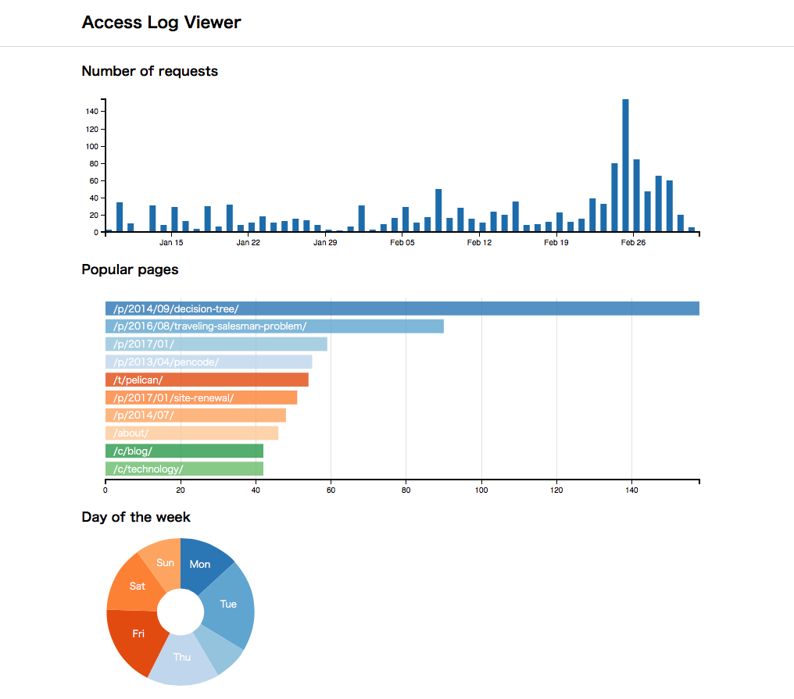

=================
Access Log Viewer
=================

Access Log Viewer using `dc.js <https://dc-js.github.io/dc.js/>`_ . Thanks to dc.js, each chart itself can be used as a UI for filtering, and other charts do transition with animation. Also, simple log parser script for default access log format in nginx ("combined" format)  is included. 

Note that this is just a toy project as a practice of dc.js.

Requirement
===========

These python libraries are needed:

- NumPy
- Pandas

If you are not familier with python, `Anaconda distribution <https://www.continuum.io/downloads>`_ is my recommendation. Numpy and Pandas are included in this distribution.

Usage
=====

At first, please prepare a access log file of nginx, and save it to a place you like. Then, run the parser script to convert CSV file.

::

   $ python scripts/parse.py <path to access log file> -o data/log.csv

Next, run the ``convert.py`` to extract necessary information.

::

   $ python scripts/convert.py data/log.csv -o html/data --days 90

Then, csv files used for visualization are saved under html/data directory. Please open ``html/index.html`` file in web browser. 

Screen Shot
===========

LICENSE
=======

MIT License
